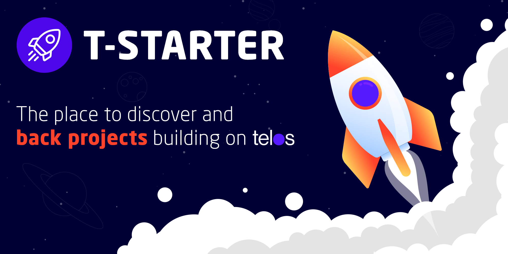

# T-STARTER

_The place to discover and back projects building on Telos._

[](https://app.tstarter.io/)
[](https://medium.com/@t-starter)
[](https://t.me/tstarterio)
[](https://twitter.com/T_StarterToken)

## Installation

**Install yarn package manager.**  
Follow the installation instructions at:
https://classic.yarnpkg.com/en/

**Add Vue and Quasar packages**

```bash
yarn global add @vue/cli
yarn global add @quasar/cli
```

Add the following to `~/.bashrc`:  
```bash
export PATH="$(yarn global bin):$PATH"
```

**Clone this repo to your local machine**

**Copy the example .env file to .env**

```bash
cp .env.dev .env
```

**Prep the environment**

Run the following in the same directory as the `package.json` file:

```bash
yarn
```

## Start the app in development mode

(Development mode enables hot-code reloading, error reporting, etc.)

```bash
quasar dev
```

## Lint the files

```bash
yarn run lint
```

## Build the app for production

```bash
quasar build
```

## More Information

- [Quasar](https://quasar.dev/)
- To customize the web-app's configuration, see [configuring quasar.conf.js](https://quasar.dev/quasar-cli/quasar-conf-js).
